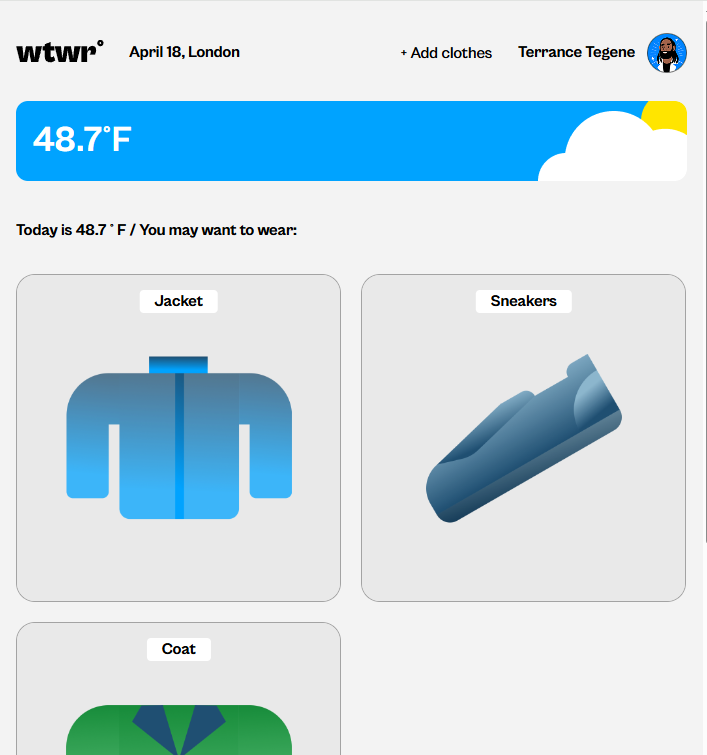

# What to Wear (WTWR)

## Project Description

WTWR (What to Wear) is an interactive web application that helps users decide what to wear based on their local weather conditions. The app fetches real-time weather data from the OpenWeather API and suggests appropriate clothing items from the user's wardrobe. Users can:

- View weather-based clothing recommendations
- Add items to their virtual wardrobe
- Organize clothes by weather type
- Toggle between Fahrenheit and Celsius
- Manage their clothing collection through a profile interface

## Functionality

- Real-time weather data integration
- Dynamic clothing suggestions based on temperature
- Responsive design for all devices
- Temperature unit conversion

## Technologies and Techniques Used

- **React** React, React Router, React Context
- **Build Tool:** Vite
- **API Integration:** OpenWeather API

### Screenshots

## Additional Resources

- [OpenWeather API Documentation](https://openweathermap.org/api/one-call-3#example)
